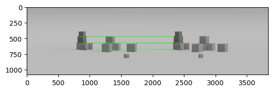

# 8-Point Algorithm for Camera Pose Estimation

Implementation of the 8-point algorithm to estimate relative camera pose (rotation and translation) from image pairs using fundamental and essential matrix decomposition.

## Overview

This project implements multiple methods for camera pose estimation from a sequence of images:
- **8-Point Algorithm** (least squares)
- **RANSAC-based** fundamental matrix estimation
- **OpenCV implementation** for comparison
- Camera trajectory reconstruction (iterative and non-iterative)

## Key Features

- Feature detection and matching using SIFT/ORB
- Fundamental matrix computation (normalized 8-point, RANSAC)
- Essential matrix recovery from intrinsic calibration
- Rotation and translation disambiguation using triangulation
- 3D camera trajectory visualization

## Visual Results

### Input Images

Image before camera translation:


Image after camera translation:


### Feature Matching
Corresponding features detected and matched between the two images using SIFT descriptors:



## Implementation Details

**Core Components:**
- `EightPoint.py` - Main implementation with 4 methods:
  - `getRotationTranslationFromImagesRANSAC()` - RANSAC-based fundamental matrix
  - `getRotationTranslationFromImagesLS()` - Least squares fundamental matrix
  - `getRotationTranslationFromImages8Point()` - Classic 8-point algorithm
  - `getRotationTranslationFromImagesOpenCV()` - OpenCV's implementation
- `processSequence.py` - Batch processing for image sequences
- `test.py` - Example usage and visualization

**Methods:**
1. Extract keypoints and descriptors (SIFT/ORB)
2. Match features between image pairs
3. Compute fundamental matrix F (8-point or RANSAC)
4. Recover essential matrix E = K^T F K
5. Decompose E into 4 candidate (R, t) solutions
6. Disambiguate using point triangulation (cheirality check)

## Usage

```python
from EightPoint import EightPoint
import cv2
import numpy as np

# Initialize
eight_point = EightPoint()

# Load images
img1 = cv2.cvtColor(cv2.imread('image1.png'), cv2.COLOR_BGR2GRAY)
img2 = cv2.cvtColor(cv2.imread('image2.png'), cv2.COLOR_BGR2GRAY)

# Camera intrinsic matrix
K = np.array([[focal_x, 0, cx],
              [0, focal_y, cy],
              [0, 0, 1]])

# Estimate pose
R, t, scale = eight_point.getRotationTranslationFromImagesRANSAC(img1, img2, K)
```

## Dependencies

See `requirements.txt` for the full list of dependencies. The requirements file is auto-generated and contains the core packages used by this project.

Install dependencies with:
```bash
pip install -r requirements.txt
```

## Results

The implementation was tested on synthetic rendered sequences with known ground truth. Results show:
- RANSAC provides robust estimation in the presence of outliers
- Iterative pose estimation accumulates drift over long sequences
- Direct estimation relative to first frame reduces accumulation error

See `/Test1/` directory for detailed CSV results comparing different methods.
